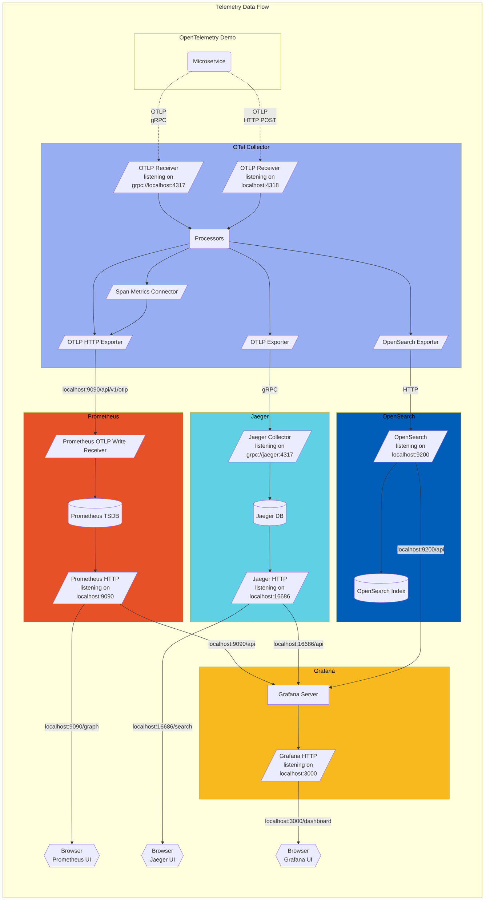

The collector is configured in
[otelcol-config.yml](https://github.com/open-telemetry/opentelemetry-demo/blob/main/src/otel-collector/otelcol-config.yml),
alternative exporters can be configured here.Reference: https://opentelemetry.io/docs/demo/architecture/



Find the **Protocol Buffer Definitions** in the `/pb/` directory.

```bash
docker compose up --force-recreate --remove-orphans --detach
```
* Northwind.WebApi: http://localhost:8080/
* Grafana: http://localhost:8080/grafana/
* Load Generator UI: http://localhost:8080/loadgen/
* Jaeger UI: http://localhost:8080/jaeger/ui/ 
> When Northwind.WebApi's environment variable: `ASPNETCORE_ENVIRONMENT=Development`, the swagger would appear !
> 